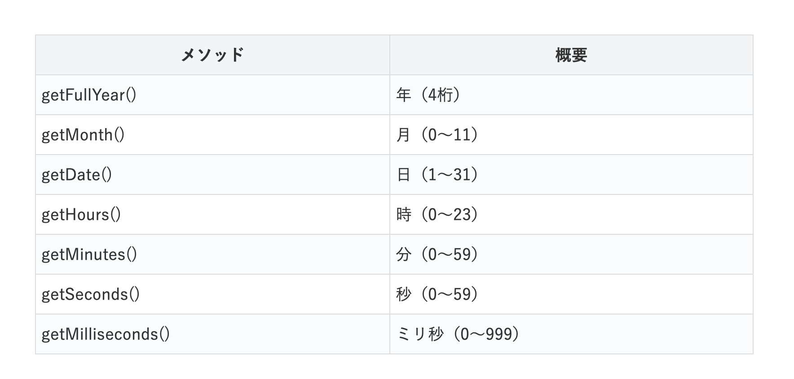

# 1.DBの扱い方

## データベースをページのロードと同時に使う際の注意点
関数を使用するときにDBで製作した関数を使用することでローカルストレージに保存をすることが可能になります。

ページの読み込みと同時にDBを使用するとTSを使用しているため、JSに変換が瞬時に行われずRepositoryが読み取れないためエラーが起こります。

```js
function main() {
  const outgoRepository = new OutgoRepository();
  const outgo = outgoRepository.getOutgo(0);
}

// 大体 100ミリ秒後に main 関数が動き出す
setTimeout(main, 100);
```
このように少し遅らせるようにすると解消されます

## Date型の設定上の月の表し方に関する注意点
Date型の仕様上月は0から始まっています
```js
const shift = {
    id: 0,
    // Idは自動で更新されるのでここでは初期値の0
    date: new Date(2021, 3, 1),
    time: 3,
};
```
このように入力したデータは
```json
{
    "id": 0,
    "date": "2021/4/1 0:00:00",
    "time": 3
},
```
このように4月として返ります

詳しくはこちら

https://www.tohoho-web.com/js/date.htm

## 1.1 支出のデータを扱う方法

### ファイルを読み込む方法
```html
<script src="https://cdn.jsdelivr.net/npm/@babel/polyfill@latest/dist/polyfill.min.js"></script>
<script src="https://cdn.jsdelivr.net/npm/@babel/standalone@latest/babel.min.js"></script>
<script type="text/babel" data-presets="typescript" src="../../DB/outgoData/OutgoApi.ts"></script>
<script type="text/babel" data-presets="typescript" src="../../DB/outgoData/OutgoEntity.ts"></script>
<script type="text/babel" data-presets="typescript" src="../../DB/outgoData/OutgoRepository.ts"></script>
```
と最初に入力することでインポートされデータベースが使えるようになる

### データの扱いかた

#### 取得
使用例として、JavaScript上で全体を取得する場合は
```js
const outgoRepository = new OutgoRepository();
const outgoAllList = outgoRepository.getOutgoList();
```

id毎にデータを取得するためには
```js
const outgoRepository = new OutgoRepository();
const outgo = outgoRepository.getOutgo(0);
```

また月ごとに取得するためには
```js
const outgoRepository = new OutgoRepository();
const outgoMonthAll = outgoRepository.getOutgoMonthAll(2021, 3);
```
月ごとにデータを取得するとobject型の中身はこうなります
```json
[
    {
        "id": 0,
        "date": "2021/4/1 0:00:00",
        "price": 1000
    },
    {
        "id": 1,
        "date": "2021/4/1 0:00:00",
        "price": 1000
    },
    {
        "id": 2,
        "date": "2021/4/1 0:00:00",
        "price": 1000
    },
    {
        "id": 3,
        "date": "2021/4/1 0:00:00",
        "price": 1000
    }
]
```

#### 追加
使用例として、JavaScript上で
```js
const outgoRepository = new OutgoRepository();

const outgo = {
    id: 0,
    //IDは自動で増えていくため初期値は0でもよい
    date: new Date(2021, 3, 1),
    price: 1000,
};

const outgoList = outgoRepository.setOutgo(outgo);
```
これを行うことによって支出データの最新のデータ全てを返します

#### 消去
使用例として、JavaScript上で
```js
const outgoRepository = new OutgoRepository();
const id = 0;
//outgo はデリートしたいidを入力します
const outgoList = outgoRepository.deleteOutgo(id);
```
これの返り値では削除された後のリストを全て返します

データの全消去は
```js
const outgoRepository = new OutgoRepository();
outgoRepository.deleteOutgoList();
```

#### 更新

使用例として、JavaScript上で
```js
const outgoRepository = new OutgoRepository();
const newOutgo = {
    id: 0,
    //IDは自動で増えていくため初期値は0でもよい
    date: new Date(2021, 3, 1),
    price: 1000,
};
const outgoList = outgoRepository.updateOutgo(newOutgo);
```
これを行うと重複したIdのデータがあったときに古い方のIdのデータを新しいデータに更新する

## 1.2 収支のデータを扱う方法

### ファイルを読み込む方法
```html
<script src="https://cdn.jsdelivr.net/npm/@babel/polyfill@latest/dist/polyfill.min.js"></script>
<script src="https://cdn.jsdelivr.net/npm/@babel/standalone@latest/babel.min.js"></script>
<script type="text/babel" data-presets="typescript" src="../../DB/shiftData/ShiftApi.ts"></script>
<script type="text/babel" data-presets="typescript" src="../../DB/shiftData/ShiftEntity.ts"></script>
<script type="text/babel" data-presets="typescript" src="../../DB/shiftData/ShiftRepository.ts"></script> 

<script type="text/babel" data-presets="typescript" src="../../DB/outgoData/OutgoApi.ts"></script>
<script type="text/babel" data-presets="typescript" src="../../DB/outgoData/OutgoEntity.ts"></script>
<script type="text/babel" data-presets="typescript" src="../../DB/outgoData/OutgoRepository.ts"></script>

<script type="text/babel" data-presets="typescript" src="../../DB/jobData/JobApi.ts"></script>
<script type="text/babel" data-presets="typescript" src="../../DB/jobData/JobEntity.ts"></script>
<script type="text/babel" data-presets="typescript" src="../../DB/jobData/JobRepository.ts"></script> 
```
と最初入力することでインポートされデータベースが使えるようになる。
収支管理は全てのデータベースを使用する

### データの扱いかた
基本的に他の三つのものと変わらない。
全てを使用しつつ取得したものを組み合わせて表示をさせる必要がある。

## 1.3 シフトデータを扱う方法

### ファイルを読み込む方法
```html
<script src="https://cdn.jsdelivr.net/npm/@babel/polyfill@latest/dist/polyfill.min.js"></script>
<script src="https://cdn.jsdelivr.net/npm/@babel/standalone@latest/babel.min.js"></script>
<script type="text/babel" data-presets="typescript" src="../../DB/shiftData/ShiftApi.ts"></script>
<script type="text/babel" data-presets="typescript" src="../../DB/shiftData/ShiftEntity.ts"></script>
<script type="text/babel" data-presets="typescript" src="../../DB/shiftData/ShiftRepository.ts"></script> 
```

### データの扱いかた

#### 取得
使用例として、JavaScript上で全体のデータを取得したい場合は
```js
const shiftRepository = new ShiftRepository();
const shiftAllList = shiftRepository.getShiftList();
```

id毎にデータを取得するためには
```js
const shiftRepository = new ShiftRepository();
const id = 0;
const shift = shiftRepository.getShift(id);
```

また月ごとに取得するためには
```js
const shiftRepository = new ShiftRepository();
const shiftMonthAll = shiftRepository.getShiftMonthAll(2021, 3);
```
月ごとにデータを取得するとobject型の中身はこうなります
```json
[
    {
        "id": 0,
        "date": "2021/4/1 0:00:00",
        "time": 3
    },
    {
        "id": 1,
        "date": "2021/4/1 0:00:00",
        "time": 3
    },
    {
        "id": 2,
        "date": "2021/4/1 0:00:00",
        "time": 3
    },
    {
        "id": 3,
        "date": "2021/4/1 0:00:00",
        "time": 3
    }
]
```

また日ごとに取得するためには
```js
const shiftRepository = new ShiftRepository();
const shiftDayAll = shiftRepository.getShiftDayAll(2021, 3, 2);
```
Date型の仕様上月は0から始まっています。
注意してコードを書いてください

#### 追加
使用例として、JavaScript上で
```js
const shiftRepository = new ShiftRepository();

const shift = {
    id: 0,
    // Idは自動で更新されるのでここでは初期値の0
    date: new Date(2021, 3, 1),
    time: 3,
};

const shiftList = shiftRepository.setShift(shift);
```
追加した後のシフトデータを全て返します

#### 消去
使用例として、JavaScript上で
```js
const shiftRepository = new ShiftRepository();
const id = 0;
//idが０の部分をデリートします
const shiftList = shiftRepository.deleteShift(id);
```

データの全消去は
```js
const shiftRepository = new ShiftRepository();
shiftRepository.deleteShiftList();
```
#### 更新

使用例として、JavaScript上で
```js
const shiftRepository = new ShiftRepository();
const newShift = {
    id: 0,
    date: new Date(2021, 3, 1),
    time: 3,
};
const shiftList = shiftRepository.updateShift(newShift);
```
これを行うと重複したIdのデータがあったときに古い方のIdのデータを新しいデータに更新する
返り値として更新後の全てのデータを返します。

## 1.4 設定のデータを扱う方法

### ファイルを読み込む方法
```html
<script src="https://cdn.jsdelivr.net/npm/@babel/polyfill@latest/dist/polyfill.min.js"></script>
<script src="https://cdn.jsdelivr.net/npm/@babel/standalone@latest/babel.min.js"></script>
<script type="text/babel" data-presets="typescript" src="../../DB/jobData/JobApi.ts"></script>
<script type="text/babel" data-presets="typescript" src="../../DB/jobData/JobEntity.ts"></script>
<script type="text/babel" data-presets="typescript" src="../../DB/jobData/JobRepository.ts"></script> 
```
と最初入力することでインポートされデータベースが使えるようになる

### データの扱いかた

#### 取得
使用例として、JavaScript上で
```js
const jobRepository = new JobRepository();
const job = jobRepository.getJob();
```
これを行なって帰ってくるデータはこのような形になります
```json
{
    "jobname": "ファミリーマート",
    "payday": 15,
    "price": 1000
}
```


#### 追加
使用例として、JavaScript上で
```js
const jobRepository = new JobRepository();

const job = {
jobname: 'ファミリーマート',
payday: 15,
price: 1000,
};

const job = jobRepository.setJob(job);
```
最新の設定のデータを返します

#### 消去
使用例として、JavaScript上で
```js
const jobRepository = new JobRepository();
const job = jobRepository.deleteJob();
```
最新の設定のデータを返します
