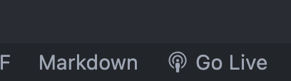
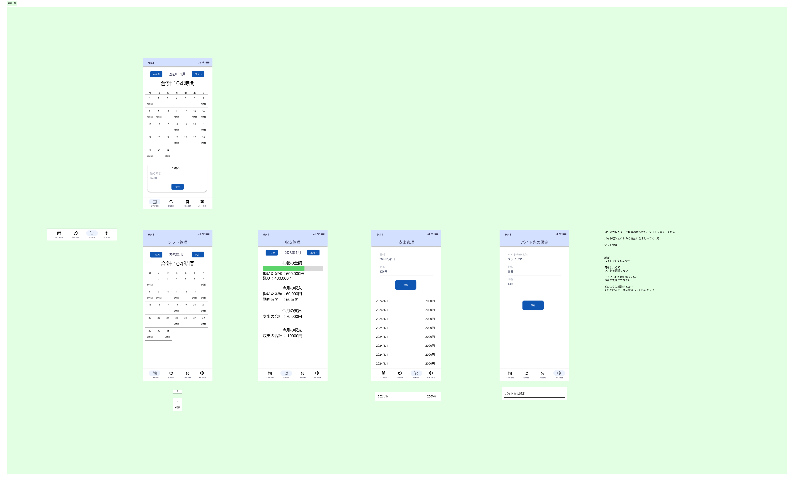

シフマネ（Shift Management）
===

# 概要
シフト管理をすることでバイト収入と支払いをまとめてくれて、扶養を計算することができるアプリケーション

# 実行方法
HTTPサーバーを用いて`./docs/`をルートにしてindex.htmlを開くことで簡単に確認をすることができる

VSCodeで開発されている場合は拡張機能GoLiveを用いて実行するとより簡単に実行することができます。



ルートIndex: `./docs/index.html`

# リリース情報

このアプリケーションは、下記URLでリリースがされています。
GitHubPagesの機能を用いて自動でリリースがされるようになっています。便利です。

https://2023ait-oop2-g06.github.io/income-and-expenditure-app/

# ユーザー定義
### 誰が
バイトをしている学生

### 何をしたくて
シフトを管理したい

### どういった問題を抱えていて
お金が管理ができない→扶養を超えているかが判断できないなど

### どのように解決するか？
支出と収入を一緒に管理してくれるアプリ

# 画面構成



Figmaで編集をして、画面の構成を行っています。
より詳しく確認したい場合は、下記URLへ
[Figmaリンク](https://www.figma.com/file/FMopiolJCdc3LMQKTz1Gcd/%E3%82%AA%E3%83%96%E3%82%B8%E3%82%A7%E3%82%AF%E3%83%88%E6%BC%94%E7%BF%922%E3%80%80%E3%83%87%E3%82%B6%E3%82%A4%E3%83%B3%E6%A1%88?type=design&node-id=2561%3A941&mode=design&t=cLxaDRwMSZv3UJMC-1)

# ライブラリ一覧

このアプリケーションは、開発環境を簡単にするためにcdnを用いたライブラリ以外は使用していません。
そのため、NodeJsやPythonなどの環境構築は一歳いらない構成となっています。
エディタとブラウザがあれば全てが完結します。

[CDNとはなにか？](https://news.mynavi.jp/techplus/article/zerojavascript-15/)

- Style系
  - Bootstrap:5.3.0
  - GoogleFont:最新バージョン
- TSのコンパイル
  - babel/polyfill:latest
  - babel/standalone:latest
- DB
  - WebStorage

# ディレクトリ構成

今回はディレクトリ構成として、各画面ごとにフォルダーを分割しました。
各画面ごとにフォルダーを分割することによって、関係ないファイルを触ってコンフリクトを起きることを防いでいます。
できれば、各画面でファイルを作成するときは、JSの中身はしっかりと役割ごとでクラスやファイルが分割されているといいなと考えています。

## 基本となるディレクトリ

このプロジェクトを開いてすぐのフォルダーからの眺めを表示しています。
基本的には、HTMLで記述をしているだけなので、そこまでわかりにくい書き方にはなっていないはず。

```
.
├── README.md → このファイルです
├── ReadmeImage → Readmeを書くために使用した画像ファイルが入っています
└── docs → ソースコードはこの中にまとめられています
    ├── DB → データを保存する記述についてまとめられています
    ├── core → 一番最初のindex.htmlの動作についてまとめられています。例えばボトムナビゲーションとか。
    ├── features → 一つ一つの画面に分かれて記述ができるように分けられています
    └── index.html → 一番最初に表示されるHTML

```

## coreのディレクトリ

coreは一番最初に表示されるindex.htmlを表示して、いろいろなページに飛ばすための機能が書かれている部分
詳しい説明はしませんが、ボトムナビゲーションを動作させるコードが書かれています。

```
core
├── css → 見た目が作られている部分
│   └── styles.css
├── img → 変更が起きない画像が保存されている部分
│   └── perfil.png
├── js → JSのコードがまとまっている部分
│   └── main.js
└── scss
```

## featuresのディレクトリ

ここは各画面ごとの動作が書かれています。
ここは結構大事なので、しっかりと確認してもらえると助かります。

```
features
├── incomeAndOutgo → 収支の画面について書かれているところ
├── jobSetting → バイト先の設定する画面について書かれているところ
├── outgo → 支出の画面について書かれているところ
└── shiftCalender → シフトのカレンダーについて書かれているところ
```

### 各ディレクトリごとの中身のファイルの説明

- css → 見た目について書かれています
  - incomeAndOutgoStayle.css
- img → 変更が起きない画像が保存されている部分
  - perfil.png
- js → JSのコードがまとまっている部分
  - incomeAndOutgoMain.js
- incomeAndOutgoScreen.html → 各画面の中身について書かれています

## DBのファイル構成

書くファイルで関心の分離(やっている仕事を分散させる)ために、以下のようにファイルを分割しました。
DBのディレクトリ構成に関しては、あまり意識しなくてもいいかも？

```
DB
├── jobData → バイト先のデータを保存するためのディレクトリ
│   ├── JobApi.ts
│   ├── JobEntity.ts
│   └── JobRepository.ts
├── outgoData → 支出を管理するためのディレクトリ
│   ├── OutgoApi.ts
│   ├── OutgoEntity.ts
│   └── OutgoRepository.ts
└── shiftData → シフトの時間を保存するためのディレクトリ
    ├── ShiftApi.ts
    ├── ShiftEntity.ts
    └── ShiftRepository.ts

```

### 各ディレクトリごとの中身のファイルの説明

- 〇〇Api.ts
  - WebStorageにアクセスするための記述だけが書かれたファイル
- 〇〇Entity.ts
  - 〇〇にまつわるデータがどのようなものなのかを提示するためのファイル
- 〇〇Repository.ts
  - WebStorageにデータを渡すためにデータを整形したり、たらないデータがあるときに突っぱねるためのファイル


# 実装方法一覧

## ボトムナビゲーションについて

ボトムナビゲーションについては、Bedimcodeさんの動画を参考にしながら実装を行っていきました。
Bedimcodeの動画では、画面の切り替えは、idとaタグをもちいて切り替えていましたが、それだと全ての画面が下に並んでしまうため、iframeを用いて、
画面を切り替えるように設定しました。

iframeをindex.htmlで用意して、js側で、画面を切り替えるようにしています。

```html:index.html
<iframe 
    src="./features/shiftCalender/shiftCalenderScreen.html" 
    frameborder="0" 
    class="container section section__height" 
    id="screen_iframe_id">
</iframe>
```

```js:main.js
//** @type {ScreenList} */
function screenChange(
    screen
) {
    document.getElementById('screen_iframe_id').contentWindow.location.replace(screen);
}


const ScreenList = Object.freeze({
    balanceObPayment: './features/incomeAndOutgo/incomeAndOutgoScreen.html',
    outgo: './features/outgo/outgoScreen.html',
    jobSetting: './features/jobSetting/jobSettingScreen.html',
    shiftCalender: './features/shiftCalender/shiftCalenderScreen.html',
})
```

#### Youtubeのリンク
https://www.youtube.com/watch?v=DjaNof-HFyY&ab_channel=Bedimcode

#### GitHubのリンク
https://github.com/bedimcode/responsive-bottom-navigation

## DBについて

詳しい仕様書(使い方のみを書いたドキュメント)については別の場所に書きます。
[DBの扱い方のリンク](./DB_README.md)を見てもらうことで理解ができると思います。
DBの実装をする方は以下の資料の確認をしてもらえるといいと思います。

### TypeScriptについて

基本的にはJSで記述を統一させようと思っていましたが、DBの記述をするときは、どうしてもTSでかかないとデータの流れが読みづらくわかりにくいため、ここだけTSを用いています。

TypeScriptとは、JavaScriptでは型がない部分をTypeScriptが補ってもらい、予測変換や文法エラーなどを検証してくれる素晴らしい言語。
大体JavaScriptと書き方が変わらないため、あまり気にしなくても大丈夫だと思う。

TypeScriptをHTMLで読み込ませるために、babelというライブラリを用いて読み込ませるようにしてあります。
htmlのheadに以下の記述を用いることで、TSをブラウザ側でJavaScriptに変換をかけてくれるようになります。
すごく便利です。

```html:./docs/features/outgo/outgoScreen.html
<script src="https://cdn.jsdelivr.net/npm/@babel/polyfill@latest/dist/polyfill.min.js"></script>
<script src="https://cdn.jsdelivr.net/npm/@babel/standalone@latest/babel.min.js"></script>
<script type="text/babel" data-presets="typescript" src="../../DB/outgoData/OutgoApi.ts"></script>
```

### WebStorageについて

DBはWebStorageを用いてデータの永続化(保存)を行うようにしました。

```ts:OutgoApi
private static key: string = 'outgoList';

    // @param {outgoModel[]} outgoList
    static setOutgoList(
        outgoList: OutgoModel[]
    ) {
        // dataでソートする
        outgoList.sort(
            (x, y) => (new Date(x.date).getTime()) - (new Date(y.date).getTime()),
        )

        const outgoListString = JSON.stringify(outgoList);

        localStorage.setItem(this.key, outgoListString);
    }

    static getOutgoList(){
        return localStorage.getItem(this.key);
    }

    static deleteOutgoList(){
        localStorage.removeItem(this.key);
    }
```

#### WebStorageの参考文献はこちら
https://qiita.com/tfrcm/items/9be5403a8e0e77cef95c


### WebStorageでListを保存する方法

WebStorage自体はDBとしてリストを保存することを目的とした機能ではないため、リストを保存するための機能が別で書かれています。
簡単に言えば、一度オブジェクトとして置いてあるListに対して追加や消去、編集の処理を加え、そのデータ自体で上書きするような形です。
データを保存するときは一度Jsonと呼ばれるObjectの形が文字型で書かれている形式に変換を行い保存をしています。
かなりまわりくどいやり方になっていますが、ライブラリを少なくして、環境構築ほとんどしないようにするためには仕方がないことです。

#### 取得のやり方

取得をするときは、基本的にはWebStorageからデータをもらってくる。
そのデータはJsonという形担っているので、JsonParseを用いて、オブジェクト型に変換する。
そうしたら、自由に扱えるようになるため、ソートをしたりフィルターをかけて、返すだけ。

```ts:OutgoRepository.ts
// ================ GET ================

    // この関数は支出のidを用いて支出のデータを一つ取得する
    // @param {number} id
    getOutgo(
        id: number,
    ){
        // DBに保存されている文字列を取得する
        const db = OutgoApi.getOutgoList();
        // 文字列からオブジェクトに変換をかける
        const outgoList:OutgoModel[] = JSON.parse(db? db : '[]');

        // idが同じ支出を取得
        const outgo = outgoList.find(outgo => outgo.id === id);
        //返す
        return outgo;
    }

    // この関数は全ての支出を取得する
    getOutgoList(){
        // DBに保存されている文字列を取得する
        const db = OutgoApi.getOutgoList();
        // 文字列からオブジェクトに変換をかける
        const outgoList:OutgoModel[] = JSON.parse(db? db : '[]');

        //そのまま全てを返す
        return outgoList;
    }

    // この関数は年と月を用いてその条件にあう支出を全て取得する
    // @param {number} year
    // @param {number} month
    getOutgoMonthAll(
        year: number,
        month: number,
    ){
        // DBに保存されている文字列を取得する
        const db = OutgoApi.getOutgoList();
        // 文字列からオブジェクトに変換をかける
        const outgoList:OutgoModel[] = JSON.parse(db? db : '[]');

        // 年と月でフィルターをかけてその月の支出を全て出力させる
        const outgoMonthAll = outgoList.filter(outgo => {
            const outgoDate = new Date(outgo.date);
            const outgoYear = outgoDate.getFullYear();
            const outgoMonth = outgoDate.getMonth() + 1;

            return outgoYear === year && outgoMonth === month;
        });

        // 返す
        return outgoMonthAll;
    }  
```

#### 保存のやり方

保存をするときの流れとしては、DBからデータを取得した後に、一番最後の支出を取得して、idに1を足すようにしています。
もし被ってしまうような場合はUUIDに変更するといいだろう。めんどくさいので今はしない。
変更したものをそのまま変数のリストに代入して、DBに上書きする形にしました。

```ts:OutgoRepository.ts
// ================== SET ==================

    // 支出のデータをもらうことで、DBに保存する
    // @param {OutgoModel} outgo
    // @return {OutgoModel[]} outgoList
    setOutgo(
        outgo: OutgoModel
    ){
        // DBに保存されている文字列を取得する
        const db = OutgoApi.getOutgoList();
        // 文字列からオブジェクトに変換をかける
        const outgoList:OutgoModel[] = JSON.parse(db? db : '[]');

        // idを設定する
        // 一番最後の支出のidに1を足す
        const lastOutgo = outgoList[outgoList.length - 1];
        outgo.id = lastOutgo ? lastOutgo.id + 1 : 0;

        // 取得したListの最後に追加する
        outgoList.push(outgo);
        // DBに上書き保存をする
        OutgoApi.setOutgoList(outgoList);

        // 最新のListを返す
        return OutgoApi.getOutgoList();
    }

    // 支出リストをもらうことで、DBに保存する
    // @param {OutgoModel[]} outgoList
    // @return {OutgoModel[]} outgoList
    setOutgoList(
        outgoList: OutgoModel[]
    ){
        // そのままDBを上書き保存する
        OutgoApi.setOutgoList(outgoList);

        // 最新のListを返す
        return this.getOutgoList();
    }

```

#### 消去のやり方


消去のやりかたとしては、一度DBからデータを取得した後に、同じIDでフィルターをかけ消去をする、その後DBに上書きをするという形で行っている

```ts:OutgoRepository.ts

// ================== DELETE ==================
// 支出を削除する関数
// @param {number} id
// @return {OutgoModel[]} outgoList
deleteOutgo(
    id: number
){
    // DBに保存されている文字列を取得する
    const db = OutgoApi.getOutgoList();
    // 文字列からオブジェクトに変換をかける
    const outgoList:OutgoModel[] = JSON.parse(db? db : '[]');

    // idが同じ支出をフィルターかける
    const newOutgoList = outgoList.filter(outgo => outgo.id !== id);
    // DBに上書き保存をする
    OutgoApi.setOutgoList(newOutgoList);

    // 最新のListを返す
    return this.getOutgoList();
}

// 全ての支出を削除する関数
// @return {OutgoModel[]} outgoList
deleteOutgoList(){
    // 全ての支出を削除する
    OutgoApi.deleteOutgoList();
    // 最新のListを返す
    return this.getOutgoList();
}

```

#### 編集のやり方

編集のやり方は消去のやり方とそこまで大きく変わらない。
一度IDでソートをかけて、そいつを消去して、その後データを追加することで編集扱いとしている。

```ts:OutgoRepository.ts

// 支出を更新する関数
    // @param {OutgoModel} outgo
    // @return {OutgoModel[]} outgoList
    updateOutgo(
        outgo: OutgoModel
    ){
        // DBに保存されている文字列を取得する
        const db = OutgoApi.getOutgoList();
        // 文字列からオブジェクトに変換をかける
        const outgoList:OutgoModel[] = JSON.parse(db? db : '[]');
        // idが同じ支出を消す
        const newOutgoList = outgoList.filter(it => it.id !== outgo.id);
        // 新しい支出を追加する
        newOutgoList.push(outgo);

        // DBに上書き保存をする
        OutgoApi.setOutgoList(newOutgoList);
        // 最新のListを返す
        return this.getOutgoList();
    }

```

## BootStrapについて

Bootstrapは簡単にCSSを書くことができるCSSのライブラリのようなものです。
今回は見た目の統一を簡単に行うためにBootStrapをもちいて行います。
詳しい実装方法は、下のYoutubeか、公式ドキュメントを翻訳しながら読んでいくことをおすすめします。

#### わかりやすいYoutubeのリンク
https://www.youtube.com/watch?v=kcPBAysgPPg&ab_channel=徳田啓【プログラミング学習チャンネル】

#### 公式ドキュメント
https://getbootstrap.jp/docs/5.3/components/accordion/


